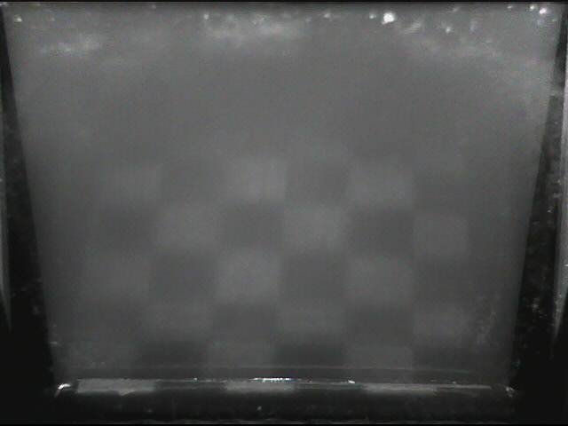

Digital Persona U.are.U 5100
============================

## Backlight

Unlike most fingerprint scanners out there, this one is just a plain ol' webcam.

Using it will be easy, right? 

Well, kinda. If you plug it in and start `cheese`, you only get a blank screen.

Now, you have use this little app and turn the lights on!

`./uareau5100 /dev/video1 on`

## Area, resolution and distortion

### Nominal

- Area: 13 x 17 mm
- Resolution: 197 x 197 ppcm

### Measured

- Area: ~16 x 19 mm
- Resolution: ~220 x 155 ppcm
- Distortion: Negligible, except for the difference of resolution between X and Y axis.

I've used a caliper to measure the glass area on the scanner.

To calculate the resolution and distortion, I scanned a checkered pattern of square with 5x5 mm, illuminated from outside with a flashlight:

The quality is not great (Fingerprint scanner are not very good at scanning paper...), but good enough for estimating.
